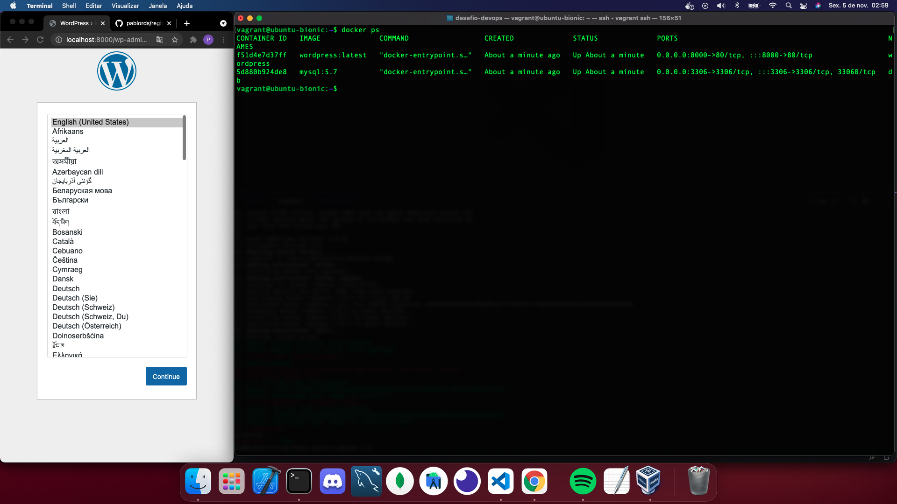

  <a href="#-tecnologias">Tecnologias</a>&nbsp;&nbsp;&nbsp;|&nbsp;&nbsp;&nbsp;
  <a href="#-como-executar">Como executar</a>&nbsp;&nbsp;&nbsp;

 

  

## ✨ Tecnologias

Esse projeto foi desenvolvido com as seguintes tecnologias:

- [Docker](https://docs.docker.com/)
- [Vagrant](https://www.vagrantup.com/)
- [Ansible](https://www.ansible.com/)

## 💻  Como executar

- Clone o repositório.
- na raiz do projeto digite `vagrant up` e aguarde a maquina virtual subir clonar o repositorio e subir os containers.
- em caso de erro na instalação do docker-compose, instale o plugin digitando `vagrant plugin install vagrant-docker-compose`.

Agora você pode acessar [`http://localhost:8000`](http://localhost:8000) do seu navegador.

- Para verificar o status dos containers, acesse a vm digitando `vagrant ssh` e logo depois `docker ps`.

